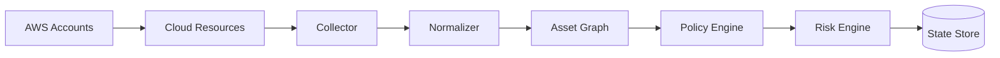
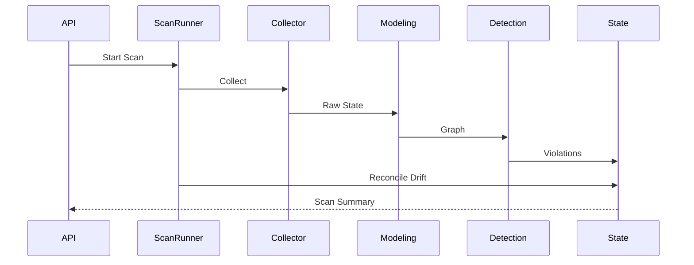

# Ingressa Architecture

## 1. Overview

Ingressa is a control-plane cloud security detection engine designed to:

- Discover cloud assets
- Normalize heterogeneous resource state
- Model attack surface relationships
- Evaluate misconfigurations deterministically
- Enforce centralized risk scoring
- Reconcile lifecycle drift across scans

The system is intentionally layered to separate:

- Data ingestion
- Resource modeling
- Detection logic
- Risk prioritization
- State persistence
- Lifecycle reconciliation

This separation mirrors production CSPM platform design.

---

## 2. Control Plane vs Cloud Boundary

Ingressa operates purely in the control plane.

It does not deploy agents.
It does not mutate cloud state.
It consumes API metadata and evaluates posture.



---

## 3. Layer Responsibilities

### 3.1 Collector Layer

**Responsibility**

- Retrieve raw inventory from cloud provider
- Abstract authentication model
- Support deterministic mock state

**Constraints**

- No detection logic
- No transformation logic
- Pure acquisition

**Implementations**

- AWSCollector
- MockAWSCollector

---

### 3.2 Normalizer Layer

**Responsibility**

- Convert provider-specific payloads into structured internal models
- Enforce consistent schema
- Remove provider noise

**Constraints**

- No risk logic
- No persistence
- Deterministic transformation only

**Output**

- Canonical resource objects

---

### 3.3 Asset Graph Engine

**Responsibility**

- Build relationship model between resources
- Support detection that depends on resource linkage

**Examples**

- EC2 → Security Group
- IAM Role → Attached Policies
- S3 Bucket → Public Access Block
- Account → CloudTrail state

The graph enables contextual detection instead of isolated checks.

---

### 3.4 Policy Engine

Core detection component.

**Components**

- Policy Registry
- Policy Runner

**Responsibilities**

- Evaluate normalized graph
- Emit structured violations
- Remain independent of severity logic

**Constraints**

- Policies do not assign severity
- Policies do not persist state

Policies are pure detection modules.

---

### 3.5 Deterministic Risk Engine

Centralized scoring authority.

**Responsibilities**

- Map violation characteristics to severity bucket
- Enforce uniform scoring model
- Prevent per-policy severity drift

**Properties**

- Deterministic
- Explainable
- CI-validated

This prevents inconsistent prioritization across policies.

---

### 3.6 State Engine

Persistence authority.

**Backed by**

- PostgreSQL 16

**Responsibilities**

- Store assets
- Store findings
- Store scan runs
- Maintain lifecycle state
- Emit finding events

**Finding identity invariant**

```
policy_id + resource_id
```

This ensures idempotent detection.

---

### 3.7 Drift Reconciliation

Executed after persistence.

**Responsibilities**

- Detect previously existing findings no longer present
- Mark findings as RESOLVED
- Avoid duplicate findings across scans

This prevents alert fatigue and supports lifecycle intelligence.

---

## 4. Scan Execution Flow

Each scan follows deterministic stages:

1. Create scan run (RUNNING)
2. Collect inventory
3. Normalize resources
4. Build asset graph
5. Execute policies
6. Apply centralized risk scoring
7. Persist findings
8. Reconcile drift
9. Mark scan SUCCESS / FAILED



---

## 5. Architectural Invariants

The following constraints are enforced:

1. Policies cannot set severity.
2. Detection is stateless per execution.
3. Scoring is centralized.
4. Findings are uniquely keyed.
5. Mock mode produces deterministic outputs.
6. Drift reconciliation always runs after persistence.

These invariants protect correctness and reproducibility.

---

## 6. Design Tradeoffs

### 6.1 Why Centralized Risk Scoring?

Prevents:

- Severity inflation
- Policy-level inconsistency
- Uncontrolled prioritization

---

### 6.2 Why Mock Mode?

Enables:

- Deterministic CI validation
- Stable testing
- Reproducible detection behavior

---

### 6.3 Why Graph-Based Modeling?

Some vulnerabilities require relational context:

- Public EC2 requires security group evaluation.
- Privilege escalation requires IAM permission graph analysis.
- CloudTrail detection requires account-level awareness.

Flat resource checks are insufficient.

---

## 7. Extensibility

Ingressa is structured to support:

- Additional cloud providers
- Expanded policy sets
- Risk weighting adjustments
- External alert integrations
- Graph database migration
- Multi-account scanning

Layer isolation enables scalable growth without coupling detection logic to infrastructure.

---

## 8. Summary

Ingressa demonstrates:

- Control-plane cloud security design
- Deterministic detection enforcement
- Structured lifecycle reconciliation
- Graph-based misconfiguration modeling
- Centralized risk prioritization

The architecture mirrors production cloud security posture engines while remaining deterministic and testable.
