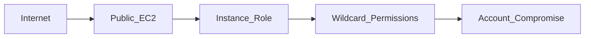

# Threat Model

## 1. Scope

Ingressa focuses on cloud control-plane misconfigurations within AWS environments.

The threat model assumes:

- An attacker has internet access.
- An attacker may obtain low-privilege credentials.
- An attacker may abuse exposed infrastructure.
- An attacker may exploit monitoring gaps.

Ingressa does not model runtime exploitation.
It models exposure conditions that enable exploitation.

---

## 2. Attacker Objectives

Primary attacker goals in cloud environments:

1. Initial access
2. Privilege escalation
3. Persistence
4. Data exfiltration
5. Defense evasion

Ingressa policies are mapped to these objectives.

---

## 3. Initial Access Vectors

### 3.1 Public Network Exposure

**Misconfigurations:**

- EC2 with public IP
- Security group allowing `0.0.0.0/0` on port 22
- Security group allowing `0.0.0.0/0` on port 3389
- Broad ingress rules on sensitive ports

**Attack Path:**

1. Internet scans detect exposed host.
2. Brute-force or credential stuffing attack.
3. Remote shell access obtained.

**Ingressa detection logic:**

- Correlates EC2 instance with attached security groups.
- Confirms public ingress rules.
- Flags exposed compute assets.

---

### 3.2 Public Object Storage

**Misconfigurations:**

- S3 bucket with public read
- S3 bucket with public write ACL

**Attack Path:**

1. Attacker enumerates public buckets.
2. Sensitive data downloaded.
3. Malicious object uploaded (if write enabled).

**Ingressa detection logic:**

- Evaluates bucket ACL.
- Evaluates bucket policy.
- Evaluates Public Access Block configuration.
- Evaluates encryption enforcement.

---

## 4. Privilege Escalation

Cloud IAM misconfigurations are a primary escalation vector.

### 4.1 Wildcard Permissions

**Example:**

```
Action: "*"
Resource: "*"
```

**Impact:**

- Full administrative access.
- Unrestricted resource control.

**Ingressa flags:**

- Wildcard action policies.
- Overly permissive IAM attachments.

---

### 4.2 Admin Without MFA

**Risk:**

- Stolen credentials enable immediate account takeover.

**Ingressa flags:**

- IAM users with admin privileges.
- MFA not enforced.

---

### 4.3 Escalation-Prone Permissions

Certain IAM actions allow:

- Policy attachment
- Role assumption
- Access key generation

These enable vertical privilege movement.

Ingressa evaluates:

- Permission sets for escalation-capable actions.
- Role-policy relationships.

---

## 5. Credential Abuse

### 5.1 Old Access Keys

**Risk:**

- Long-lived credentials increase compromise window.
- Stale keys often remain active.

**Ingressa flags:**

- IAM access keys exceeding age threshold.

---

## 6. Defense Evasion

### 6.1 CloudTrail Disabled

Without logging:

- Attacker activity becomes invisible.
- Incident response becomes blind.

**Ingressa flags:**

- Missing or disabled CloudTrail configurations.

---

## 7. Attack Surface Modeling

Cloud attack surface consists of:

- Publicly reachable resources
- Excessive IAM privileges
- Unmonitored environments
- Persistent credentials
- Broad resource policies

Ingressa models these exposures via structured detection logic.

---

## 8. Example Attack Chain

Illustrative escalation chain:

1. Public EC2 exposure (SSH open to world)
2. Credential brute force
3. Access IAM instance role
4. Role has wildcard permissions
5. Attacker escalates to account-level control



Ingressa detects:

- Public EC2 exposure
- Over-permissive IAM roles

Even if exploitation has not occurred.

---

## 9. Non-Goals

Ingressa does not:

- Perform runtime malware detection
- Monitor host-level activity
- Inspect network packets
- Detect exploit payloads

It operates exclusively at cloud configuration level.

---

## 10. Risk Prioritization Context

Misconfigurations are prioritized based on:

- Public exposure severity
- Privilege breadth
- Data sensitivity
- Monitoring absence

Centralized risk scoring ensures consistent severity mapping.

---

## 11. Summary

Ingressa threat model focuses on:

- Cloud control-plane abuse
- Misconfiguration exploitation
- Privilege escalation paths
- Exposure-driven compromise
- Logging blind spots

Detection is designed to identify exposure conditions before exploitation occurs.

The system reflects practical cloud attack patterns rather than theoretical vulnerabilities.
